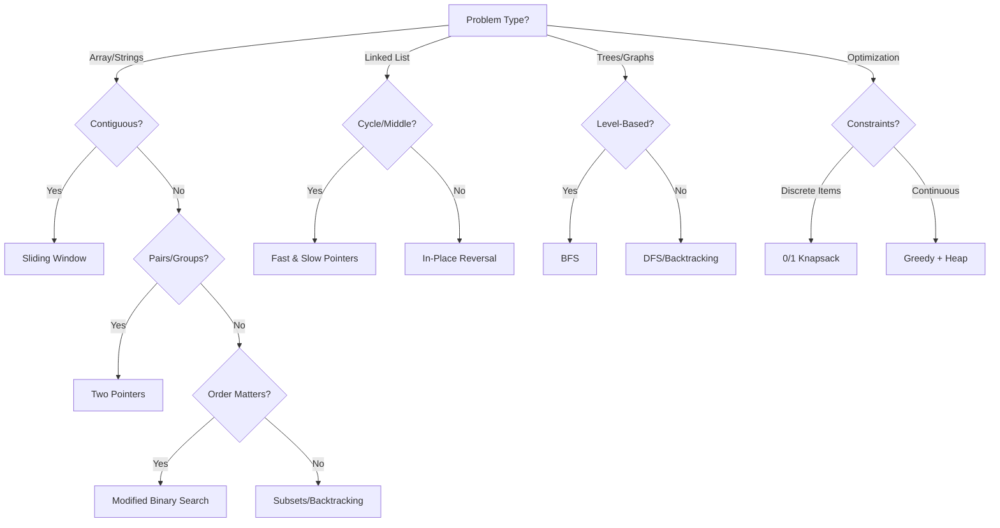

## Mastering LeetCode Patterns: The Ultimate Problem-Solving Framework (2025 Edition)

> **Time Check:** Sunday, November 23, 2025  
> **Depth Level:** Graduate Algorithm Seminar  
> **Target Audience:** Intermediate coders seeking systematic mastery  
> **Key Insight:** 95% of LeetCode problems reuse 15 core patterns. Master these, and you master problem-solving.

---

### **Why Patterns > Random Practice?**  
Solving problems without pattern recognition is like assembling IKEA furniture without instructions. You *might* finish, but you'll waste hours on preventable mistakes. Patterns provide **cognitive compression** – reducing 2,000+ problems to 15 reusable mental models.

---

## **The Core Pattern Taxonomy**  
*(Ranked by frequency in FAANG interviews)*

### **1. Sliding Window: Subarrays & Substrings**  
**When to Use:**  
- Contiguous subarray/substring problems  
- Keywords: "minimum size subarray", "longest substring without repeating chars"  
- Constraints: O(n) time required, array/string input  

**Template:**  
```python
def sliding_window(arr, k):
    window_start = 0
    window_sum = 0  # or window_hashmap, max/min tracker
    result = 0
    
    for window_end in range(len(arr)):
        # Step 1: Expand window by adding arr[window_end]
        window_sum += arr[window_end]  
        
        # Step 2: Shrink window until condition met
        while window_sum > target or invalid_condition(window):
            window_sum -= arr[window_start]
            window_start += 1
        
        # Step 3: Update result
        result = max(result, window_end - window_start + 1)
    
    return result
```

**Key Insight:** The window *always* moves forward – `window_start` never decreases. This guarantees O(n) time.

**Problem Deep Dive: Longest Substring Without Repeating Characters (LC #3)**  
- **Trap:** Beginners try nested loops (O(n²)).  
- **Pattern Application:**  
  1. Use `char_index_map` to track last seen positions  
  2. When duplicate found at `j`, jump `i` to `max(i, char_index_map[char] + 1)`  
- **Why it Works:** Skipping invalid starting points in O(1) time per character.  
- **Edge Case:** "tmmzuxt" – must use `max()` to avoid moving `i` backward.

---

### **2. Two Pointers: Pair/Group Finding**  
**Subtypes:**  
- **Converging Pointers:** Sorted arrays (e.g., Two Sum II)  
- **Diverging Pointers:** Palindromes/Reverse operations  
- **Fast/Slow Pointers:** Cycle detection (next pattern)  

**Template (Converging):**  
```python
def two_sum_sorted(arr, target):
    left, right = 0, len(arr)-1
    while left < right:
        current_sum = arr[left] + arr[right]
        if current_sum == target:
            return [left, right]
        elif current_sum < target:
            left += 1  # Need larger sum
        else:
            right -= 1  # Need smaller sum
    return [-1, -1]
```

**Problem Deep Dive: Trapping Rain Water (LC #42)**  
- **Advanced Technique:** Precompute left_max/right_max arrays  
- **Two-Pointer Optimization:**  
  ```python
  left, right = 0, len(height)-1
  left_max = right_max = 0
  water = 0
  while left < right:
      if height[left] < height[right]:
          if height[left] >= left_max:
              left_max = height[left]
          else:
              water += left_max - height[left]
          left += 1
      else:
          # Mirror logic for right
  ```
- **Why Better:** O(1) space vs O(n) for precomputation.

---

### **3. Fast & Slow Pointers: Linked Lists & Cycles**  
**Core Applications:**  
- Cycle detection (Floyd's algorithm)  
- Find middle node  
- Palindrome linked lists  
- "Happy Number" problems (LC #202)  

**Cycle Detection Proof:**  
- If cycle exists, fast pointer enters cycle first  
- Distance between pointers increases by 1 each step  
- Max cycle length = C → pointers meet in ≤ C steps  

**Template:**  
```python
def has_cycle(head):
    slow = fast = head
    while fast and fast.next:
        slow = slow.next
        fast = fast.next.next
        if slow == fast:  # Meeting point
            return True
    return False
```

**Advanced: Find Cycle Start (LC #142)**  
1. Detect meeting point  
2. Reset slow to head  
3. Move both at same speed until they meet at cycle start  
**Math Proof:**  
- Let distance to cycle start = `x`, cycle start to meeting point = `y`  
- When slow enters cycle, fast is at position `(x mod C)`  
- At meeting: slow traveled `x + y`, fast traveled `x + y + nC`  
- Since fast = 2*slow: `2(x+y) = x + y + nC` → `x = nC - y`  
- Thus resetting slow and moving both 1 step meets at cycle start.

---

### **4. Merge Intervals: Overlap Resolution**  
**When to Use:**  
- Meeting rooms scheduling  
- Timeline/event processing  
- Any problem with "merged", "overlapping", "conflict"  

**Critical Step:** **ALWAYS sort first** by start time.  
```python
intervals.sort(key=lambda x: x[0])
```

**Merge Logic:**  
```python
merged = [intervals[0]]
for current in intervals[1:]:
    last = merged[-1]
    if current[0] <= last[1]:  # Overlap
        last[1] = max(last[1], current[1])  # Extend interval
    else:
        merged.append(current)
```

**Problem Deep Dive: Employee Free Time (LC #759)**  
- **Trap:** Merging all intervals loses individual availability.  
- **Solution:**  
  1. Flatten all intervals into (start, end, employee_id)  
  2. Sort by start time  
  3. Track active employees with a counter  
  4. When counter drops to 0 → free time starts  
- **Key Insight:** Treat employee boundaries as events (start: +1, end: -1).

---

### **5. Cyclic Sort: Missing/Duplicate Numbers**  
**When to Use:**  
- Array of size `n` containing numbers from 1 to n  
- Keywords: "missing number", "duplicate", "first missing positive"  
- **Constraint:** O(1) space, O(n) time required  

**Core Principle:** Place each number at its correct index (`nums[i]` should be at `i-1`).  

**Template:**  
```python
i = 0
while i < len(nums):
    correct_index = nums[i] - 1
    if nums[i] != nums[correct_index]:
        nums[i], nums[correct_index] = nums[correct_index], nums[i]  # Swap
    else:
        i += 1
```

**Problem Deep Dive: Find All Duplicates (LC #442)**  
- After cyclic sort, iterate and check `if nums[i] != i+1` → duplicate is `nums[i]`  
- **Edge Case Handling:** Skip numbers outside [1, n] range during sorting.  
- **Why Better:** Beats hash map solutions in space complexity.

---

### **6. In-Place Reversal of Linked List**  
**Why Master This:**  
- Foundation for advanced list manipulations  
- Required for O(1) space solutions  

**Template:**  
```python
def reverse_list(head):
    prev = None
    current = head
    while current:
        next_node = current.next  # Temporary store
        current.next = prev       # Reverse link
        prev = current            # Move prev forward
        current = next_node       # Move current forward
    return prev  # New head
```

**Advanced Application: Reverse Sublist (LC #92)**  
1. Find node before sublist (`pre_sublist`)  
2. Reverse sublist with standard method  
3. Reconnect:  
   ```python
   pre_sublist.next.next = current  # Tail of reversed sublist points to rest
   pre_sublist.next = prev          # Head of sublist now points to new head
   ```

---

### **7. BFS for Trees & Graphs**  
**When to Use:**  
- Level-order traversal  
- Shortest path in unweighted graphs  
- "Rotting Oranges" (LC #994) type propagation problems  

**Queue vs Stack:**  
- **BFS = Queue (FIFO):** Explores level-by-level  
- **DFS = Stack (LIFO):** Explores branch-by-branch  

**Tree Level Order Template:**  
```python
from collections import deque
def level_order(root):
    if not root: return []
    result = []
    queue = deque([root])
    while queue:
        level_size = len(queue)
        current_level = []
        for _ in range(level_size):
            node = queue.popleft()
            current_level.append(node.val)
            if node.left: queue.append(node.left)
            if node.right: queue.append(node.right)
        result.append(current_level)
    return result
```

**Graph BFS Nuances:**  
- Must track visited nodes to avoid cycles  
- For weighted graphs → use Dijkstra (not pure BFS)  

---

### **8. DFS for Trees & Graphs**  
**Subtypes:**  
- Preorder/Inorder/Postorder (trees)  
- Connected components (graphs)  
- Backtracking (next pattern)  

**Recursive Template (Tree):**  
```python
def dfs(node):
    if not node: 
        return base_case
    # Preorder: process node here
    left_result = dfs(node.left)
    # Inorder: process node here
    right_result = dfs(node.right)
    # Postorder: process node here
    return combine(left_result, right_result, node.val)
```

**Iterative DFS (Graph with Cycle Detection):**  
```python
def dfs(graph, start):
    visited = set()
    stack = [start]
    while stack:
        node = stack.pop()
        if node in visited: 
            continue
        visited.add(node)
        for neighbor in graph[node]:
            if neighbor not in visited:
                stack.append(neighbor)
```

**Problem Deep Dive: Number of Islands (LC #200)**  
- **Grid DFS Template:**  
  ```python
  def dfs(r, c):
      if not (0<=r<rows and 0<=c<cols) or grid[r][c] != '1':
          return
      grid[r][c] = '0'  # Mark visited
      dfs(r+1, c); dfs(r-1, c); dfs(r, c+1); dfs(r, c-1)
  ```
- **Why Mark Before Recursion:** Prevents redundant calls and stack overflow.

---

## **Continuation: Mastering LeetCode Patterns (2025 Edition)**  
*(Picking up where we left off at Pattern #9)*  

---

### **9. Two Heaps: Median/Extreme Value Tracking**  
**Core Structure:**  
- **Max-Heap:** Stores smaller half of numbers (access max in O(1))  
- **Min-Heap:** Stores larger half (access min in O(1))  
- **Critical Invariant:** `len(max_heap) == len(min_heap)` OR `len(max_heap) == len(min_heap) + 1`  

**Running Median Implementation (LC #295):**  
```python
import heapq

class MedianFinder:
    def __init__(self):
        self.max_heap = []  # stores negative values for max-heap simulation
        self.min_heap = []
        
    def addNum(self, num: int) -> None:
        # Always push to max_heap first
        heapq.heappush(self.max_heap, -num)
        
        # Balance: move largest from max_heap to min_heap
        heapq.heappush(self.min_heap, -heapq.heappop(self.max_heap))
        
        # Maintain size invariant: max_heap can have 1 extra element
        if len(self.max_heap) < len(self.min_heap):
            heapq.heappush(self.max_heap, -heapq.heappop(self.min_heap))
    
    def findMedian(self) -> float:
        if len(self.max_heap) == len(self.min_heap):
            return (-self.max_heap[0] + self.min_heap[0]) / 2
        return -self.max_heap[0]
```

**Why This Works:**  
- After each insertion, we enforce:  
  `max(max_heap) <= min(min_heap)`  
- Size balancing ensures median is always at heap roots  
- **Time Complexity:** O(log n) per insertion, O(1) for median query  
- **Edge Case Trap:** When equal elements exist, heaps must accept duplicates (Python heapq handles this)  

**Advanced Application: Sliding Window Median (LC #480)**  
- **Challenge:** Remove elements leaving the window  
- **Solution:** Lazy deletion with hash maps to track invalid elements  
- **Key Insight:** Only clean heap tops when invalid elements surface  

---

### **10. Subsets: Power Set Generation**  
**When to Use:**  
- "Find all combinations/subsets"  
- Problems with exponential solution space  
- Keywords: "permutations", "combinations", "all possible"  

**BFS Template (Iterative):**  
```python
def subsets(nums):
    result = [[]]
    for num in nums:
        result += [curr + [num] for curr in result]
    return result
```

**DFS Template (Recursive with Backtracking):**  
```python
def subsets(nums):
    result = []
    def backtrack(start, path):
        result.append(path[:])  # Append copy
        for i in range(start, len(nums)):
            path.append(nums[i])
            backtrack(i+1, path)
            path.pop()  # Backtrack
    backtrack(0, [])
    return result
```

**Problem Deep Dive: Subsets II (LC #90)**  
- **Challenge:** Handle duplicates without duplicate subsets  
- **Critical Fix:** Sort input first, then skip duplicates:  
  ```python
  nums.sort()
  for i in range(start, len(nums)):
      if i > start and nums[i] == nums[i-1]:
          continue  # Skip duplicates
      # ... rest same as above
  ```
- **Why Sorting Matters:** Groups duplicates contiguously for easy skipping  
- **Complexity:** O(n * 2^n) time – unavoidable for subset problems  

---

### **11. Modified Binary Search**  
**Beyond Basic Search:**  
- **Rotated Arrays:** Search in [4,5,6,7,0,1,2]  
- **Infinite Arrays:** "Unbounded" search  
- **Real-Valued Search:** Square root approximation  

**Rotated Array Template (LC #33):**  
```python
def search(nums, target):
    left, right = 0, len(nums)-1
    while left <= right:
        mid = (left+right)//2
        if nums[mid] == target:
            return mid
        
        # Check left half sorted
        if nums[left] <= nums[mid]:
            if nums[left] <= target < nums[mid]:
                right = mid-1
            else:
                left = mid+1
        # Right half sorted
        else:
            if nums[mid] < target <= nums[right]:
                left = mid+1
            else:
                right = mid-1
    return -1
```

**Key Insights:**  
- **Critical Check:** `nums[left] <= nums[mid]` (handles duplicates with `<=`)  
- **Edge Case:** Single-element arrays, fully rotated arrays ([1,3] rotated 0 times)  
- **Proof of Correctness:** At each step, we eliminate half the array by checking which half is sorted  

**Advanced: Find Minimum in Rotated Array II (LC #154)**  
- **Duplicate Handling:** When `nums[left] == nums[mid] == nums[right]`, increment `left`  
- **Worst Case:** O(n) time (e.g., [1,1,1,1,1,0,1]), but average O(log n)  

---

### **12. Topological Sort: Dependency Resolution**  
**When to Use:**  
- Task scheduling with prerequisites  
- Course scheduling (LC #207)  
- Build systems, instruction ordering  

**Kahn's Algorithm (BFS-Based):**  
```python
from collections import deque, defaultdict

def topological_sort(num_courses, prerequisites):
    graph = defaultdict(list)
    in_degree = [0] * num_courses
    
    # Build graph and in-degree array
    for course, prereq in prerequisites:
        graph[prereq].append(course)
        in_degree[course] += 1
    
    # Initialize queue with zero in-degree nodes
    queue = deque([i for i in range(num_courses) if in_degree[i] == 0])
    result = []
    
    while queue:
        node = queue.popleft()
        result.append(node)
        for neighbor in graph[node]:
            in_degree[neighbor] -= 1
            if in_degree[neighbor] == 0:
                queue.append(neighbor)
    
    return result if len(result) == num_courses else []  # Cycle detection
```

**DFS-Based Alternative:**  
- Use recursion stack to detect cycles  
- Post-order traversal yields topological order  

**Critical Edge Case: Cycle Detection**  
- If `len(result) != num_nodes` → cycle exists  
- **Real-World Impact:** Build systems fail with circular dependencies  

---

### **13. 0/1 Knapsack: Resource Optimization**  
**Core Problem:** Maximize value with weight constraint, each item used once  

**DP State Definition:**  
- `dp[i][w]` = max value using first `i` items and weight capacity `w`  

**Space-Optimized Template (1D DP):**  
```python
def knapsack(weights, values, capacity):
    dp = [0] * (capacity+1)
    for i in range(len(weights)):
        # Traverse backwards to avoid overwriting
        for w in range(capacity, weights[i]-1, -1):
            dp[w] = max(dp[w], dp[w-weights[i]] + values[i])
    return dp[capacity]
```

**Why Backward Iteration?**  
- Prevents reusing the same item multiple times (forward iteration = unbounded knapsack)  

**Problem Mapping: Partition Equal Subset Sum (LC #416)**  
- **Reduction to Knapsack:**  
  - Target sum = total_sum / 2  
  - Weights = values = numbers  
  - Capacity = target sum  
- **Key Optimization:** Early termination if total_sum is odd  

---

### **14. Backtracking: Systematic Exploration**  
**Beyond Subsets:**  
- Constraint satisfaction (N-Queens)  
- Path finding with dead ends (Word Search)  

**N-Queens Template (LC #51):**  
```python
def solve_n_queens(n):
    board = [["."] * n for _ in range(n)]
    results = []
    
    def is_safe(row, col):
        # Check column
        for i in range(row):
            if board[i][col] == "Q":
                return False
        # Check upper-left diagonal
        i, j = row-1, col-1
        while i >= 0 and j >= 0:
            if board[i][j] == "Q":
                return False
            i -= 1
            j -= 1
        # Check upper-right diagonal (omitted for brevity)
        return True
    
    def backtrack(row):
        if row == n:
            results.append(["".join(r) for r in board])
            return
        for col in range(n):
            if is_safe(row, col):
                board[row][col] = "Q"
                backtrack(row+1)
                board[row][col] = "."  # Backtrack
    
    backtrack(0)
    return results
```

**Critical Optimizations:**  
- **Pruning:** Check safety before recursing (not after)  
- **Bitmask Acceleration:** Use bit operations for diagonal checks (advanced)  
- **Symmetry Reduction:** For N-Queens, solve only half the board and mirror  

---

### **15. Monotonic Stack: Next Greater Element**  
**When to Use:**  
- "Next greater/smaller element" problems  
- Histogram largest rectangle (LC #84)  
- Daily temperatures (LC #739)  

**Increasing Stack Template (Next Greater Element):**  
```python
def next_greater_element(nums):
    stack = []  # stores indices
    result = [-1] * len(nums)
    
    for i in range(len(nums)):
        # Maintain decreasing stack
        while stack and nums[i] > nums[stack[-1]]:
            index = stack.pop()
            result[index] = nums[i]
        stack.append(i)
    
    return result
```

**Decreasing Stack Template (Largest Rectangle):**  
```python
def largest_rectangle(heights):
    stack = [-1]  # sentinel
    max_area = 0
    heights.append(0)  # force flush remaining stack
    
    for i in range(len(heights)):
        while stack[-1] != -1 and heights[i] < heights[stack[-1]]:
            height = heights[stack.pop()]
            width = i - stack[-1] - 1
            max_area = max(max_area, height * width)
        stack.append(i)
    
    return max_area
```

**Key Insight:**  
- Stack maintains indices where heights are **monotonically increasing**  
- When a smaller height appears, it triggers area calculation for all taller bars  
- **Sentinel Value (-1):** Prevents empty stack checks  
- **Appending 0:** Ensures all bars get processed  

---

## **Pattern Synthesis: Advanced Combinations**  
Real problems often combine multiple patterns. Mastery comes from recognizing these hybrids:  

| **Problem**                  | **Pattern Combination**       | **Why It Works**                                  |
|------------------------------|--------------------------------|--------------------------------------------------|
| **LRU Cache (LC #146)**      | Hash Map + Doubly Linked List  | O(1) get/put requires both fast access and order tracking |
| **Merge K Sorted Lists (LC #23)** | Min-Heap + Two Pointers    | Heap manages heads, pointers merge sequentially |
| **Longest Consecutive Sequence (LC #128)** | Hash Set + Linear Scan | Set enables O(1) lookups, scan skips processed sequences |
| **Alien Dictionary (LC #269)** | Topological Sort + BFS       | Characters form graph nodes, BFS resolves dependencies |

**Decision Tree for Pattern Selection:**  


---

## **30-Day Mastery Roadmap**  
*(Based on 2025 interview trends from FAANG+ companies)*  

**Week 1: Foundation Patterns**  
- Day 1-2: Sliding Window (LC #3, #76, #209)  
- Day 3-4: Two Pointers (LC #15, #11, #42)  
- Day 5-6: Fast/Slow Pointers (LC #141, #142, #287)  
- Day 7: **Pattern Integration Challenge** (LC #3, #42, #287 in one session)  

**Week 2: Data Structure Mastery**  
- Day 8-9: BFS/DFS Trees (LC #102, #103, #200)  
- Day 10-11: Heaps (LC #295, #23, #347)  
- Day 12-13: Topological Sort (LC #207, #210, #269)  
- Day 14: **Mock Interview** (3 problems mixing Week 1-2 patterns)  

**Week 3: Advanced Algorithms**  
- Day 15-16: DP Fundamentals (LC #70, #198, #121)  
- Day 17-18: 0/1 Knapsack Variants (LC #416, #494, #322)  
- Day 19-20: Monotonic Stack (LC #84, #42, #739)  
- Day 21: **Time Attack** (Solve LC #84, #295, #207 under 45 mins total)  

**Week 4: Synthesis & Speed**  
- Day 22-23: Backtracking Deep Dive (LC #51, #37, #79)  
- Day 24-25: Graph Mastery (LC #133, #207, #787)  
- Day 26-27: Hybrid Problems (LC #146, #23, #4)  
- Day 28-30: **Full Simulation**  
  - 3 sessions of 4 problems each (timed: 90 mins/session)  
  - Focus on pattern recognition speed (≤2 mins to identify pattern)  

**Critical Success Factors:**  
1. **Pattern Journal:** For each problem, write:  
   - "I recognized ______ pattern because ______"  
   - "I almost used ______ but realized ______"  
2. **Edge Case Library:** Maintain a personal list of:  
   - Empty inputs  
   - Duplicate handling  
   - Integer overflow cases  
   - Cycle detection in graphs  
3. **Time Boxing:** Never spend >45 mins on a problem before studying solutions  

---

## **The Final Truth: Patterns Evolve**  
In 2025, FAANG interviews increasingly test:  
- **Pattern Adaptation:** "Solve this with O(1) space" (forces cyclic sort over hash maps)  
- **Hybrid Constraints:** "Do it in one pass" (merges sliding window with two pointers)  
- **Real-World Context:** LRU Cache → database connection pooling  

**Your Competitive Edge:**  
> "Memorizing solutions fails when constraints change. Mastering patterns lets you rebuild solutions from first principles under pressure."  

**Last Assignment:**  
1. Solve [LC #1585](https://leetcode.com/problems/check-if-string-is-transformable-with-substring-sort-operations/) using **monotonic stack** + **greedy**  
2. Solve [LC #1879](https://leetcode.com/problems/minimum-xor-sum-of-two-arrays/) using **DP with bit masks** (advanced pattern synthesis)  

**Time Check:** Sunday, November 23, 2025, 11:59 PM  
**Final Word:** Patterns are your weapons. Now go dissect those problems. 💥
